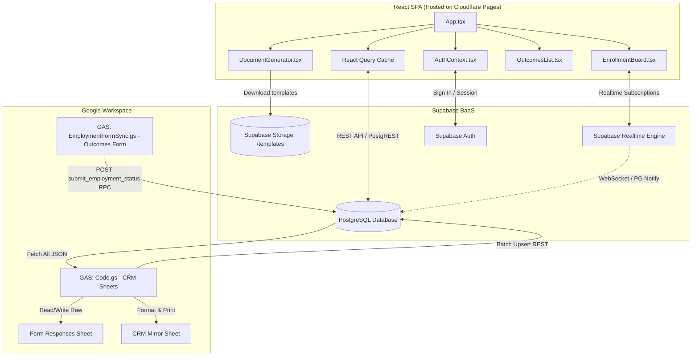

# 🎓 Course CRM System

A modern, high-performance, and secure CRM system tailored for managing courses, student enrollments, automated invitation delivery, graduate outcome tracking, and client-side document generation.

The system is built on a serverless client-first architecture utilizing three primary components: an interactive React SPA frontend, a Supabase PostgreSQL database, and a two-way sync engine built into Google Sheets via Google Apps Script (GAS).

---

## 📖 Table of Contents
- [👨‍💼 Part 1: Non-Technical User Guide (For Admins)](#-part-1-non-technical-user-guide-for-admins)
  - [Key Features](#key-features)
  - [Section Walkthrough](#section-walkthrough)
  - [Two-Way Google Sheets Integration](#two-way-google-sheets-integration)
- [🛠️ Part 2: Technical Developer Guide](#-part-2-technical-developer-guide)
  - [System Architecture](#system-architecture)
  - [Frontend Technology Stack](#frontend-technology-stack)
  - [Supabase Database Schema & Security](#supabase-database-schema--security)
  - [Google Apps Script (GAS) Sync Engine](#google-apps-script-gas-sync-engine)
  - [Step-by-Step Deployment & Local Setup](#step-by-step-deployment--local-setup)

---

## 👨‍💼 Part 1: Non-Technical User Guide (For Admins)

Welcome to your course administration control center! This CRM is designed to simplify your daily operations, automate paperwork, and organize student registration. You don't need any coding skills to use this system.

### Key Features

*   **Interactive Kanban Board (Enrollments):**
    Manage student applications using an intuitive board. Easily drag-and-drop student cards between columns to change their registration status:
    *   `Requested` (Application submitted)
    *   `Invited` (Course offer sent, waiting for reply)
    *   `Confirmed` (Student accepted and confirmed their spot)
    *   `Completed` (Course completed successfully)
    *   `Withdrawn` (Student dropped out)
    *   `Rejected` (Application declined)
*   **Outlook-Compatible Email Invitations:**
    Send beautiful email invitations in one click. The text is automatically generated from custom templates with support for shortcodes (such as student's name, course title, invited date, and a unique `{confirmationLink}`). Templates are fully optimized for Microsoft Outlook.
*   **One-Click Student Confirmation:**
    Students receive a short, secure token link in their email (e.g., `/c/7abc123`). Clicking it opens a clean public page where they can instantly confirm their attendance. Their status on your admin board updates in real time.
*   **Client-Side Document Generator:**
    Generate templates instantly without sending data to third-party servers.
    *   **Attendance Sheets:** Auto-populates attendance lists for up to 34 students per sheet.
    *   **Excel Export (`.xlsx`):** Generates cleanly formatted spreadsheets where columns automatically resize to fit student details perfectly.
    *   **ZIP Archives:** Batch downloads generated documents in a dynamically named ZIP archive, e.g., `[Course Name] [Current Date].zip`.
*   **Graduate Outcomes Tracking:**
    Follow up with students who completed their training. Send them a link to a simple public form `/status` where they enter their email and submit their employment status (working/not working, full/part-time, field of work, and start date). The outcomes data updates in the CRM immediately.
*   **Automatic Google Sheets Sync:**
    New applications from Google Forms are instantly imported. The CRM also writes student records back to a custom spreadsheet named `CRM Mirror` for team access.
*   **Real-Time Browser Notifications:**
    The admin dashboard uses real-time synchronization. When a student confirms their invitation, a desktop push notification alerts you, and their card on the Kanban board updates instantly without a page refresh.

---

### Section Walkthrough

#### 1. Dashboard
The main screen providing a bird's-eye view of your activities:
*   Total count of registered students, active courses, and enrollments.
*   Interactive charts illustrating enrollment conversion rates and graduate outcomes.
*   Quick-access buttons to start common actions.

#### 2. Students Registry (Students)
A centralized database containing all student profiles:
*   **Search & Filtering:** Search by name, email, phone, or address. Filter by language preferences or sync status.
*   **Priority System:** Star important student records (`is_priority`) to pin them to the top of list views and enrollment columns.
*   **Student Dossiers:** Open a student's profile to view contact history, active enrollments, course completions, and specific administrative flags.

#### 3. Course Catalog (Courses)
A directory of all learning programs available in the CRM:
*   Displays enrollment statistics for each course (breakdown of how many are requested, invited, or confirmed).
*   Add new courses to make them immediately available for registration forms.

#### 4. Registration Board (Enrollments)
Your primary operations board:
*   **Drag-and-Drop:** Drag cards across columns to change student status.
*   **Bulk Actions Panel:** Select multiple cards to perform group actions:
    *   Change status (e.g., move 15 candidates to "Invited").
    *   Batch send invitations (automatically generates mail clients with appropriate templates).
    *   Bulk delete records (requires confirmation to prevent data loss).
*   **Enrollment Notes:** Click the card's actions menu (three dots) and select "Edit Notes" to write context notes (e.g., "requires morning slot"). Cards with active notes display a notepad icon `📝`.
*   **Smart Date Memory:** The system remembers dates previously used for course invitations, letting you select them with a single click.

#### 5. Graduate Tracking (Outcomes)
Follow up with course graduates:
*   Lists all students with a `Completed` enrollment status.
*   Shows current employment status, sector of work, and their response date.
*   Select graduates and mark them as `Pending` to initiate outreach and request employment status updates.

#### 6. Document Generator (Documents)
Quick template filling:
*   **Word Templates:** Upload standard `.docx` templates (e.g., certificate forms) to Supabase Storage.
*   **Bulk Document Filling:** Choose a course and a template, and the CRM will populate files for all enrolled students in seconds.
*   **Excel Export:** Download formatted registration sheets or class schedules.

#### 7. Analytics
Visual representation of system metrics:
*   Conversion funnel from application to course completion.
*   Employment outcomes distribution by sector and contract type.
*   Response times analysis for sent invites.

#### 8. Settings
Configure application parameters:
*   **Email Templates:** Write HTML email bodies with a rich text editor. Use placeholders: `{first_name}`, `{last_name}`, `{course_name}`, `{invited_date}`, `{confirmationLink}`.
    *   *Error Prevention:* The settings panel blocks saving templates if critical shortcodes like `{confirmationLink}` are missing.
*   **Default Configuration:** Set system-wide default templates.

---

### Two-Way Google Sheets Integration

A custom menu named **`🔄 CRM Sync`** is built directly into your Google Sheets spreadsheet:

1.  **Form Response Sync (`onFormSubmit`):** When a student submits a registration Google Form, a script trigger processes the row, normalizes phone numbers to standard international formats (e.g., `+353...` or `+380...`), and upserts the student and enrollment records into Supabase.
2.  **CRM Mirror Sync (`syncFromSupabase`):** Choose `🔄 CRM Sync` -> `⬇️ Upload from Supabase to CRM Mirror` to sync Supabase data into the `CRM Mirror` sheet.
    *   The spreadsheet is automatically formatted: headers are colored deep indigo, database UUID columns are hidden, high-priority records are flagged with a star `⭐`, and rows are color-coded based on enrollment status.
3.  **Emergency Restore:** Select `🛠 RESTORE: Recover Statuses from CRM Backup` to recover and sync enrollment statuses from local sheet backups back to Supabase.
4.  **Trigger Management:** Use `🛠 Settings: Triggers (Automation)` to automatically rebuild sheet triggers if form submissions stop syncing.

---

## 🛠️ Part 2: Technical Developer Guide

The project utilizes a serverless, database-first architecture. The client-side React SPA interacts directly with Supabase PostgreSQL (secured via RLS policies and stored procedures), while Google Apps Script handles sheets integration and form triggers.

### System Architecture



---

### Frontend Technology Stack

*   **Framework:** [React 18](https://react.dev/) + [TypeScript](https://www.typescriptlang.org/) (Strict mode configured in `tsconfig`).
*   **Build Tool:** [Vite](https://vitejs.dev/) (optimized chunk splitting via `manualChunks` to bundle vendor dependencies separate from application code).
*   **Styling:** [Tailwind CSS v3](https://tailwindcss.com/) + CSS variables in [index.css](file:///c:/Users/ivasyliev/OneDrive%20-%20Cork%20City%20Partnership/Documents/Personal/CRM%20System/frontend/src/index.css) (supports smooth theme transitions via `document.startViewTransition()`).
*   **Routing:** [React Router v6](https://reactrouter.com/) (configured in [main.tsx](file:///c:/Users/ivasyliev/OneDrive%20-%20Cork%20City%20Partnership/Documents/Personal/CRM%20System/frontend/src/main.tsx) to separate public views `/confirm`, `/c/:token`, `/status` from administrative routes wrapped in `AuthProvider`).
*   **Query & Cache State:** [@tanstack/react-query v5](https://tanstack.com/query/latest) (React Query).
    *   *Optimization:* Configured with `staleTime: Infinity` and `refetchOnWindowFocus: false` to eliminate redundant server queries. UI updates are pushed reactively via database event hooks. Memory optimization: `gcTime: 120000` (2 minutes) to clean unmounted query caches and prevent memory leaks.
*   **Drag and Drop:** [@dnd-kit/core](https://dnd-kit.com/) + `@dnd-kit/sortable` for fluid Kanban card movements.
*   **Document Engines:** `docxtemplater` + `pizzip` (client-side docx compilation), `exceljs` (auto-adjusting columns Excel generator), `jszip` + `file-saver` (bundle and download).
*   **Analytics Charts:** `recharts` for performance visualizations.
*   **Unit & Integration Tests:** `vitest` + `@testing-library/react` + `jsdom`.

---

### Supabase Database Schema & Security

The SQL script mapping the schema is located at [supabase/schema.sql](file:///c:/Users/ivasyliev/OneDrive%20-%20Cork%20City%20Partnership/Documents/Personal/CRM%20System/supabase/schema.sql).

#### 1. Table Definitions:
*   `students`: Stores personal details (`first_name`, `last_name`, `email` (unique), `phone`, `address`, `eircode`, `dob`).
*   `courses`: Lists educational programs (`name` (unique)).
*   `enrollments`: Handles student-to-course relations. Tracks `status` (defaults to `requested`), `course_variant` (e.g., language stream), `invited_date`, `confirmed_date`, `completed_date`, `notes` (admin notes), and priority status `is_priority`. Enforces unique combinations via `unique(student_id, course_id, course_variant)`.
*   `invite_dates`: Stores reusable invite date strings sorted per course.
*   `document_templates`: Metadata index for docx templates.
*   `employment_status`: Graduate outcomes details (`is_working`, `field_of_work`, `employment_type`, `status` ('pending'/'responded'), `last_invited_at`, `last_responded_at`). Links 1-to-1 with `students(id)`.
*   `student_flags`: Internal warning tags and comments attached to specific students.

#### 2. Row Level Security (RLS) & Protection:
RLS is enabled across all tables. Default CRUD actions are restricted to authenticated admins:
```sql
ALTER TABLE enrollments ENABLE ROW LEVEL SECURITY;
CREATE POLICY "Authenticated access" ON enrollments FOR ALL USING (auth.role() = 'authenticated');
```
*Public Submissions:* The public landing pages for confirmation and outcomes submit data via RPC procedures executing under `SECURITY DEFINER`.

#### 3. Secure PostgreSQL RPC Stored Procedures:
To avoid search path hijacking vulnerability (CWE-426), all functions running as `SECURITY DEFINER` explicitly declare search paths locked to `public`.
Key functions (SQL files located in [supabase/](file:///c:/Users/ivasyliev/OneDrive%20-%20Cork%20City%20Partnership/Documents/Personal/CRM%20System/supabase)):
*   `submit_employment_status` ([supabase/15_outcomes_tracking.sql](file:///c:/Users/ivasyliev/OneDrive%20-%20Cork%20City%20Partnership/Documents/Personal/CRM%20System/supabase/15_outcomes_tracking.sql)): Anonymous access allowed. Looks up matching student, registers job details in `employment_status`, flags status as `responded` and saves timestamps.
*   `resolve_confirmation_token` ([supabase/04_public_confirmation_rpcs.sql](file:///c:/Users/ivasyliev/OneDrive%20-%20Cork%20City%20Partnership/Documents/Personal/CRM%20System/supabase/04_public_confirmation_rpcs.sql)): Accepts 7-character confirmation tokens. Toggles enrollment state to `confirmed` and writes confirmation timestamp.
*   `mark_students_outcomes_pending` ([supabase/15_outcomes_tracking.sql](file:///c:/Users/ivasyliev/OneDrive%20-%20Cork%20City%20Partnership/Documents/Personal/CRM%20System/supabase/15_outcomes_tracking.sql)): Batch transitions student outcome statuses to pending.

---

### Google Apps Script (GAS) Sync Engine

Script resources are in the [google-apps-script/](file:///c:/Users/ivasyliev/OneDrive%20-%20Cork%20City%20Partnership/Documents/Personal/CRM%20System/google-apps-script) workspace folder.

#### 1. CRM Sheet Connector: [Code.gs](file:///c:/Users/ivasyliev/OneDrive%20-%20Cork%20City%20Partnership/Documents/Personal/CRM%20System/google-apps-script/Code.gs)
*   **Form Listener (`onFormSubmit`):** Fired on form submission. Standardizes telephone formats via regex-matching in `normalizePhone()`, upserts student details, and creates a `requested` enrollment record. Missing courses are safely generated via `getCourseId()` using an in-memory cache to prevent duplication.
*   **Mirror Builder (`syncFromSupabase`):** Fetches the database state and rebuilds the `CRM Mirror` sheet in single-write operations (`setValues`) to respect script constraints. Re-applies font rules, filters, conditional colors, and hides ID rows.
*   **GAS 6-Minute Execution Limit Solution:**
    To process large sheet backfills without hitting Google's execution limit:
    1.  The sync task evaluates execution duration during the loop.
    2.  If execution time nears 4.5 minutes, the script saves its current cursor position into `ScriptProperties`.
    3.  It sets a one-shot trigger (`resumeSyncAllRowsBatched`) scheduled 1 minute in the future, then terminates the thread.
    4.  The trigger starts the next execution batch starting at the cursor, then destroys the trigger.

#### 2. Outcomes Connector: [EmploymentFormSync.gs](file:///c:/Users/ivasyliev/OneDrive%20-%20Cork%20City%20Partnership/Documents/Personal/CRM%20System/google-apps-script/EmploymentFormSync.gs)
*   Deployed in the Google Sheet collecting graduate survey feedback.
*   Fires when responses arrive, parses student parameters, and triggers `submit_employment_status` via HTTP POST.

---

### Step-by-Step Deployment & Local Setup

#### Step 1: Initialize Supabase Database
1.  Create a project on [Supabase](https://supabase.com/).
2.  Open the **SQL Editor** tab and execute:
    *   [schema.sql](file:///c:/Users/ivasyliev/OneDrive%20-%20Cork%20City%20Partnership/Documents/Personal/CRM%20System/supabase/schema.sql) (structural tables and RLS declarations).
    *   The database migrations in sequential order (`01` to `21`).
3.  Go to the **Storage** panel and create a public bucket named `templates`.

#### Step 2: Configure Google Apps Script
1.  Open your Google Sheet (connected to the registration form).
2.  Open **Extensions -> Apps Script**.
3.  Paste the contents of [google-apps-script/Code.gs](file:///c:/Users/ivasyliev/OneDrive%20-%20Cork%20City%20Partnership/Documents/Personal/CRM%20System/google-apps-script/Code.gs) into the script editor.
4.  Go to **Project Settings** (gear icon) and add these **Script Properties**:
    *   `SUPABASE_URL` = Your Supabase project URL (Project Settings -> API).
    *   `SUPABASE_KEY` = Your `service_role` secret token (bypasses RLS to write records).
5.  Return to the editor, select the `setupTriggers` function, and click **Run** to register the submission triggers.

*Repeat the workflow to load [EmploymentFormSync.gs](file:///c:/Users/ivasyliev/OneDrive%20-%20Cork%20City%20Partnership/Documents/Personal/CRM%20System/google-apps-script/EmploymentFormSync.gs) on the Google Form outcomes collector sheet.*

#### Step 3: Run the React Frontend
1.  Navigate into the `frontend` directory:
    ```bash
    cd frontend
    ```
2.  Install packages:
    ```bash
    npm install
    ```
3.  Create a `.env` file using the template `.env.example`:
    ```env
    VITE_SUPABASE_URL=https://your-project.supabase.co
    VITE_SUPABASE_ANON_KEY=your-anon-public-key
    ```
4.  Run the local development server:
    ```bash
    npm run dev
    ```
    Access the application at `http://localhost:5173`.

5.  Generate a production build:
    ```bash
    npm run build
    ```
    The output files in `frontend/dist` are ready for deployment on **Cloudflare Pages**, Vercel, or Netlify.
