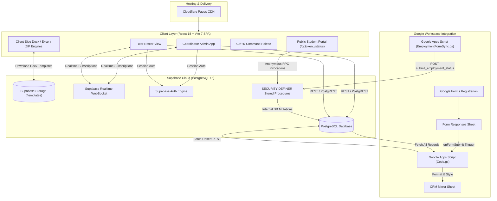

# 🎓 Course CRM System

<div align="center">

[](https://react.dev/)
[](https://www.typescriptlang.org/)
[](https://vitejs.dev/)
[](https://supabase.com/)
[](https://tailwindcss.com/)
[](https://vitest.dev/)
[](https://pages.cloudflare.com/)
[](#-license)

**A high-performance, real-time Course CRM and student management platform.**  
Seamlessly synchronizes Google Forms and Google Sheets with Supabase PostgreSQL, featuring interactive drag-and-drop enrollment pipelines, automated Outlook-ready invitation delivery, instant public student portals, client-side document generation, and graduate outcome tracking.

[Features](#-key-features) • [Architecture](#-system-architecture) • [Tech Stack](#-tech-stack) • [Quick Start](#-quick-start--local-development) • [Deployment](#-deployment) • [Troubleshooting](#-troubleshooting)

</div>

---

## 🌟 Overview

The **Course CRM System** was built to streamline course administration, reduce administrative overhead, and automate the student lifecycle from initial registration to post-graduation employment tracking. 

Built on a **serverless, client-first architecture**, it pairs a responsive React SPA with Supabase PostgreSQL (secured with Row Level Security and PostgreSQL RPC stored procedures) and a resilient two-way sync engine written in Google Apps Script (GAS) to seamlessly bridge Google Forms and Google Sheets.

---

## ✨ Key Features

### 📋 Interactive Kanban Enrollment Pipeline
* **Fluid Drag-and-Drop:** Move candidate cards across lifecycle stages (`Requested` ➔ `Invited` ➔ `Confirmed` ➔ `Completed` ➔ `Withdrawn` / `Rejected`) powered by `@dnd-kit`.
* **Real-Time State Updates:** Supabase PostgreSQL Realtime channels automatically update the board across all active coordinator dashboards without page refreshes.
* **Bulk Operation Workflows:** Batch-invite students, update enrollment stages in bulk, or perform confirmed deletions.
* **Priority Pinning & Contextual Notes:** Star high-priority students to pin them to the top of columns, and attach administrative notes (`📝`) directly to enrollment cards.
* **Smart Invite Date Memory:** Remembers recently selected invitation dates per course for rapid one-click scheduling.

### ✉️ Outlook-Ready Invitations & Student Portal
* **One-Click Email Invitations:** Generate rich HTML emails compatible with Microsoft Outlook desktop and web clients using dynamic template placeholders (`{first_name}`, `{course_name}`, `{invited_date}`, `{confirmationLink}`).
* **Instant Tokenized Confirmations (`/c/:token`):** Students receive short, secure 7-character token links to view course details and confirm their attendance in a single click.
* **Calendar Integration:** Confirmed students can download an `.ics` calendar invitation file with course dates, location, and coordinator notes.
* **Dynamic Expiration Windows:** Configurable invitation deadlines (`response_days`, defaults to 7 days). Expired invitations prompt an informative expiration alert.
* **Secure Mailto Decline Flow:** Safe cancellation and decline workflows directing inquiries directly to program coordinators.

### 👥 Student Directory & Smart Deduplication
* **Global Search & Filter:** Instant search by name, email, phone, Eircode/postcode, address, or language preferences.
* **Interactive Student Merge Tool (`MergeModal`):** Automatically detects duplicate records by email, phone, or normalized name, enabling coordinators to compare profiles and merge enrollments and notes into a primary profile without data loss.
* **Student History & Flags:** Full audit log of completed courses, invitations, attendance rates, and behavioral/administrative flags.

### 📄 Zero-Server Document & Label Generator
* **Client-Side `.docx` Template Compilation:** Generate course certificates and attendance sheets directly in the browser via `docxtemplater` and `pizzip` without transmitting sensitive student data to third-party APIs.
* **Attendance Sheets:** Auto-populates attendance sheets formatted for up to 34 students per page.
* **Mailing Sticker Labels:** Formatted layouts for Avery-compatible address label stickers for physical mailouts.
* **Formatted Excel Export (`.xlsx`):** Produces styled spreadsheets with auto-fitted columns and headers via `exceljs`.
* **ZIP Archive Packaging:** Downloads batched documents in an organized `.zip` file archive via `jszip` and `file-saver`.

### 🎓 Graduate Outcomes Tracking
* **Post-Graduation Surveys:** Coordinators transition completed students to `Pending Outcomes` to track employment progression.
* **Public Self-Reporting Portal (`/status`):** Students verify via email and submit employment details (employment status, sector, contract type, and start dates).
* **Automated Sync:** Submissions process through secure PostgreSQL RPC functions (`submit_employment_status`) and reflect immediately in CRM reports.

### 🔄 Two-Way Google Sheets & Forms Sync Engine
* **Form Submission Hook (`onFormSubmit`):** Google Form applications instantly validate, standardize phone numbers into E.164 international format (e.g., `+353...`), and upsert student and enrollment records into Supabase.
* **Formatted `CRM Mirror` Sheet:** Creates and refreshes a formatted Google Sheet mirror with custom headers, status-based row coloring, priority stars, and hidden UUID columns for administrative reporting.
* **Execution Limit Resilience:** Solves Google Apps Script's 6-minute hard timeout by evaluating execution timers at 4.5 minutes, persisting the cursor in `ScriptProperties`, and scheduling a chained one-shot trigger to resume large batch operations.

### 🛡️ Role-Based Access & Tutor View
* **Coordinator Admin View:** Full management over courses, templates, settings, and enrollments.
* **Tutor Portal (`ViewerCourses`):** Dedicated read-only view for course tutors to inspect rosters, verify candidate details, and request completion sign-offs (`PendingApprovalsModal`).

### ⌨️ Command Palette & Mobile-First Design
* **Global Command Palette:** Hit `Ctrl+K` or `Cmd+K` anywhere in the app to quickly jump between courses, search students, switch views, or toggle theme modes.
* **Full Keyboard Navigation:** Complete shortcut mapping accessible via `?` modal.
* **Responsive Mobile UI:** Dedicated bottom navigation bar (`MobileBottomNav`) and quick-action floating buttons (`MobileFloatingActions`) optimized for touchscreens.

---

## 🏗️ System Architecture


```mermaid
graph TD
    %% Public & Client Layer
    subgraph Client ["Client Layer (React 18 + Vite 7 SPA)"]
        Admin[Coordinator Admin App]
        Tutor[Tutor Roster View]
        PublicPortal["Public Student Portal (/c/:token, /status)"]
        CmdPalette[Ctrl+K Command Palette]
        DocEngine["Client-Side Docx / Excel / ZIP Engines"]
    end

    %% Edge Hosting
    subgraph Hosting ["Hosting & Delivery"]
        CF[Cloudflare Pages CDN]
    end

    %% Database & BaaS Layer
    subgraph Supabase ["Supabase Cloud (PostgreSQL 15)"]
        DB[("PostgreSQL Database")]
        Storage[("Supabase Storage (/templates)")]
        Realtime["Supabase Realtime WebSocket"]
        Auth["Supabase Auth Engine"]
        RPC["SECURITY DEFINER Stored Procedures"]
    end

    %% Google Workspace Integration
    subgraph GoogleWorkspace ["Google Workspace Integration"]
        GForm["Google Forms Registration"]
        GAS_Sync["Google Apps Script (Code.gs)"]
        GAS_Outcomes["Google Apps Script (EmploymentFormSync.gs)"]
        Sheet_Resp["Form Responses Sheet"]
        Sheet_Mirror["CRM Mirror Sheet"]
    end

    %% Interactions
    CF --> Client
    Admin --> |REST / PostgREST| DB
    Tutor --> |REST / PostgREST| DB
    Admin --> |Session Auth| Auth
    Tutor --> |Session Auth| Auth
    Admin <--> |Realtime Subscriptions| Realtime
    Tutor <--> |Realtime Subscriptions| Realtime
    DocEngine <--> |Download Docx Templates| Storage
    PublicPortal --> |Anonymous RPC Invocations| RPC
    RPC --> |Internal DB Mutations| DB

    GForm --> Sheet_Resp
    Sheet_Resp --> |onFormSubmit Trigger| GAS_Sync
    GAS_Sync --> |Batch Upsert REST| DB
    DB --> |Fetch All Records| GAS_Sync
    GAS_Sync --> |Format & Style| Sheet_Mirror
    GAS_Outcomes --> |POST submit_employment_status| RPC
```

---

## 💻 Tech Stack

| Domain | Technology / Library | Description |
| :--- | :--- | :--- |
| **Frontend Core** | [React 18.2](https://react.dev/) + [TypeScript 5.2](https://www.typescriptlang.org/) | Strict-type component architecture |
| **Build & Bundler** | [Vite 7.3](https://vitejs.dev/) | Ultra-fast HMR and optimized chunk splitting |
| **Styling & UI** | [Tailwind CSS 3.4](https://tailwindcss.com/) + [Lucide Icons](https://lucide.dev/) | Utility-first responsive design with CSS variable theming |
| **Routing** | [React Router v7](https://reactrouter.com/) | Public routes, authenticated layouts, tutor views |
| **Server State & Cache** | [@tanstack/react-query v5](https://tanstack.com/query/latest) | Memory-optimized query caching with event-driven invalidation |
| **Drag & Drop** | [@dnd-kit/core](https://dnd-kit.com/) + `@dnd-kit/sortable` | Accessible, touch-friendly Kanban column movements |
| **Document Generation** | `docxtemplater`, `pizzip`, `exceljs`, `jszip` | In-browser client-side `.docx`, `.xlsx`, and `.zip` building |
| **Rich Text Editor** | `react-quill-new` | Template authoring with variable validation |
| **Charts & Metrics** | `recharts` | Visual enrollment funnels and outcome distributions |
| **Backend & Storage** | [Supabase](https://supabase.com/) | PostgreSQL 15, Row Level Security, Realtime, Object Storage |
| **Automation** | Google Apps Script (GAS) | Form listeners, phone normalization, mirror sync |
| **Testing** | [Vitest 4.1](https://vitest.dev/) + React Testing Library | 200 unit and integration tests with `jsdom` |

---

## 📂 Repository Structure

```text
CRM-From-Google/
├── frontend/                     # React + Vite TypeScript SPA
│   ├── src/
│   │   ├── components/           # UI components (Kanban board, modals, lists, navigation)
│   │   │   ├── Analytics/        # Conversion & outcome charts
│   │   │   ├── EnrollmentBoard/  # Kanban columns, cards, bulk actions
│   │   │   ├── ui/               # Reusable primitives (Buttons, Dialogs, Badges)
│   │   │   ├── CommandPalette.tsx# Global Ctrl+K command palette
│   │   │   ├── ConfirmationPage.tsx # Public student confirmation portal
│   │   │   ├── DocumentGenerator.tsx# Client-side docx/xlsx generator
│   │   │   ├── MergeModal.tsx    # Student duplicate merger
│   │   │   ├── ViewerCourses.tsx # Tutor-specific roster view
│   │   │   └── ...
│   │   ├── contexts/             # AuthContext, NotificationContext
│   │   ├── hooks/                # Custom React hooks (Realtime, media queries)
│   │   ├── lib/                  # Supabase client, phone formatting, calendar helpers
│   │   ├── App.tsx               # Root component & navigation container
│   │   └── main.tsx              # Router setup & query client configuration
│   ├── package.json              # Frontend dependencies and scripts
│   ├── tailwind.config.js        # Design tokens and theme customization
│   └── vite.config.ts            # Vite configuration & chunking strategy
├── supabase/                     # Database migrations & schemas
│   ├── schema.sql                # Base database schema definitions
│   └── [01-45]_*.sql             # Sequential migrations (RPCs, indexes, RLS, features)
├── google-apps-script/           # Google Workspace automation
│   ├── Code.gs                   # CRM Sheets integration & form sync
│   └── EmploymentFormSync.gs     # Graduate outcomes Google Form sync
├── docs/                         # Additional project documentation & audits
├── .env.example                  # Environment configuration template
└── README.md                     # Project documentation
```

---

## 🔐 Database & Security Model

The database is built on Supabase PostgreSQL with robust security primitives:

1. **Row Level Security (RLS):**
   * Default CRUD operations on tables (`students`, `courses`, `enrollments`, `document_templates`, etc.) are restricted strictly to authenticated coordinators (`auth.role() = 'authenticated'`).
2. **Hardened `SECURITY DEFINER` Stored Procedures:**
   * Public interactions (invitation confirmation and outcome reporting) invoke PostgreSQL RPC functions operating under `SECURITY DEFINER`.
   * To prevent **search path hijacking (CWE-426)**, all stored functions explicitly enforce `SET search_path = public`.
3. **Core RPC Procedures:**
   * `resolve_confirmation_token(p_token)`: Safely validates and activates a student confirmation token.
   * `public_confirm_enrollment(...)`: Confirms attendance while strictly verifying the `response_days` deadline window.
   * `public_decline_enrollment(...)`: Securely processes student decline requests.
   * `submit_employment_status(...)`: Records graduate employment outcomes without granting direct table update privileges.
   * `merge_students(...)`: Transacts duplicate student profiles, updating all associated enrollments, flags, and notes atomically.

---

## 🚀 Quick Start & Local Development

### Prerequisites
* [Node.js](https://nodejs.org/) (v18.0 or newer recommended)
* [npm](https://www.npmjs.com/) (or yarn / pnpm)
* A [Supabase](https://supabase.com/) project
* (Optional) Google Workspace account with Google Sheets & Forms

---

### Step 1: Clone the Repository
```bash
git clone https://github.com/ihorvasyliev-gh/CRM-From-Google.git
cd CRM-From-Google
```

---

### Step 2: Configure Supabase Database
1. Open your project dashboard on [Supabase](https://supabase.com/).
2. Navigate to the **SQL Editor**.
3. Run [supabase/schema.sql](supabase/schema.sql) to set up core tables and baseline RLS policies.
4. Apply the migrations in [supabase/](supabase/) sequentially from `01` through `45`.
5. Navigate to **Storage** and create a public bucket named `templates` for document and certificate files.

---

### Step 3: Configure Environment Variables
Navigate to the `frontend` folder and create your `.env` file:
```bash
cd frontend
cp ../.env.example .env
```
Populate `.env` with your Supabase credentials:
```env
VITE_SUPABASE_URL=https://your-project-id.supabase.co
VITE_SUPABASE_ANON_KEY=your-anon-public-key
```

---

### Step 4: Install Dependencies & Run Frontend
```bash
# Inside the frontend/ directory
npm install

# Start the Vite development server
npm run dev
```
Open `http://localhost:5173` in your browser.

---

### Step 5: Run Automated Tests
Execute the full Vitest suite (all 200 unit and component tests):
```bash
# Run tests once
npm run test:run

# Run in interactive watch mode
npm run test
```

---

### Step 6: Deploy Google Apps Script Integration
1. Open your target Google Sheet linked to student registration Google Forms.
2. In the top menu, navigate to **Extensions** ➔ **Apps Script**.
3. Paste the contents of [google-apps-script/Code.gs](google-apps-script/Code.gs) into the editor.
4. In **Project Settings** (gear icon), add the following **Script Properties**:
   * `SUPABASE_URL`: Your Supabase project URL (`https://xyz.supabase.co`).
   * `SUPABASE_KEY`: Your Supabase `service_role` secret key (required to bypass RLS for background ingestion).
5. In the script editor, select `setupTriggers` from the function dropdown and click **Run** to register the form submission listener.
6. *(Optional)* For graduate survey forms, follow the same procedure with [google-apps-script/EmploymentFormSync.gs](google-apps-script/EmploymentFormSync.gs).

---

## 🌐 Deployment

### Cloudflare Pages (Recommended)
1. Link your GitHub repository to [Cloudflare Pages](https://pages.cloudflare.com/).
2. Set the build configuration:
   * **Root directory:** `frontend`
   * **Build command:** `npm run build`
   * **Build output directory:** `dist`
3. Add environment variables:
   * `VITE_SUPABASE_URL`
   * `VITE_SUPABASE_ANON_KEY`
4. The frontend includes standard single-page app (SPA) fallback redirects configured for seamless client-side routing on Cloudflare Pages.

### Vercel / Netlify
Alternatively, deploy via the Vercel or Netlify CLI by specifying `frontend` as the root directory and `dist` as the publish directory.

---

## 🔍 Troubleshooting

| Issue | Cause | Solution |
| :--- | :--- | :--- |
| **401 Unauthorized / RLS Errors** | Missing or expired Supabase session | Verify user is authenticated; check table RLS policies in `schema.sql`. |
| **GAS Script Timeout Error** | Processing large sheet backfills exceeding 6 min | Use the built-in batched sync `syncFromSupabase()` which auto-schedules trigger continuations. |
| **Phone Formats Not Matching** | Non-standard inputs in Google Form | `normalizePhone()` automatically cleans spaces, dashes, and prepends international country codes (`+353`, `+380`). Verify script regex in `Code.gs`. |
| **Docx Template Placeholders Unfilled** | Missing or misspelled variable tag | Ensure template variables match `{first_name}`, `{last_name}`, `{course_name}`, `{invited_date}`, or custom variables configured in Settings. |
| **Token Link Shows Expired** | Passed `response_days` deadline | Check the `response_days` setting on the course/enrollment (default 7 days) or resend an invitation with an updated timeframe. |

---

## 📄 License

Private Repository. All rights reserved.  
Developed for **Cork City Partnership** educational and community training programs.
