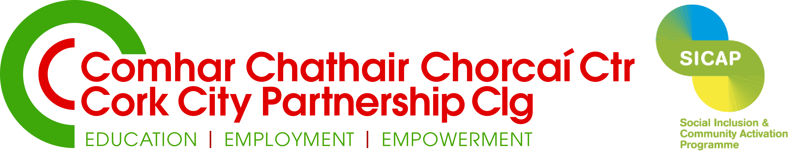
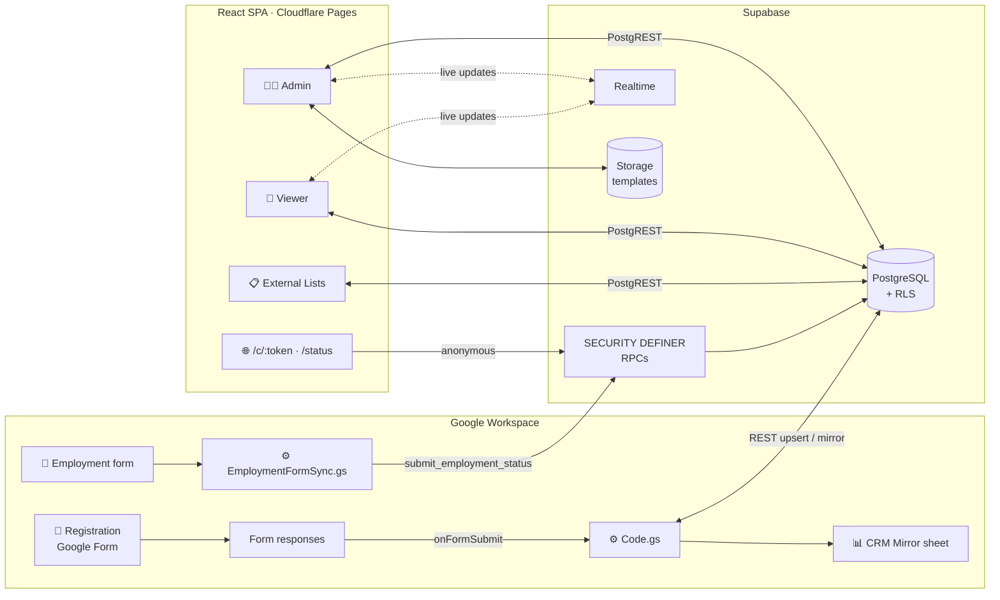
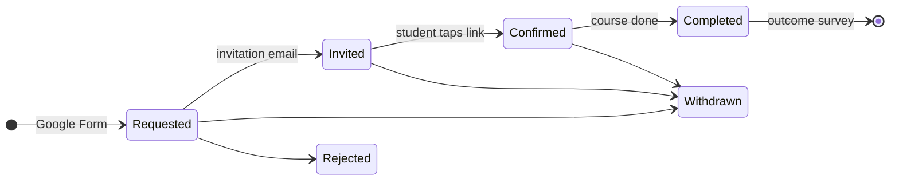

<div align="center">



<h1>🎓 CCP CRM</h1>

<p><strong>Student enrollment, course and graduate-outcome management for Cork City Partnership.</strong><br/>
Google Forms in, a real-time Kanban board in the middle, invitations, certificates and outcome surveys out.</p>

<p>
  <a href="https://react.dev/"></a>
  <a href="https://www.typescriptlang.org/"></a>
  <a href="https://vitejs.dev/"></a>
  <a href="https://tailwindcss.com/"></a>
  <br/>
  <a href="https://supabase.com/"></a>
  <a href="https://developers.google.com/apps-script"></a>
  <a href="https://vitest.dev/"></a>
  <a href="https://pages.cloudflare.com/"></a>
</p>

<p>
  <a href="#-features">Features</a> ·
  <a href="#-how-it-works">How it works</a> ·
  <a href="#-roles">Roles</a> ·
  <a href="#-tech-stack">Tech stack</a> ·
  <a href="#-quick-start">Quick start</a> ·
  <a href="#-deployment">Deployment</a> ·
  <a href="#-troubleshooting">Troubleshooting</a>
</p>

</div>

---

## ✨ Features

<table>
<tr>
<td width="50%" valign="top">

### 📋 Enrollment board
- Drag-and-drop Kanban from **Requested → Invited → Confirmed → Completed**, with **Withdrawn / Rejected** kept to one side
- Live updates for every coordinator through Supabase Realtime
- Bulk invite, move, copy emails, generate documents and delete
- A one-click **Undo** for destructive moves
- Priority stars, notes, per-course queue positions and student flags
- Duplicate enrollments blocked in the database, the UI and the sync script

</td>
<td width="50%" valign="top">

### ✉️ Invitations & public pages
- Outlook-ready HTML invitations and reminders, with a template for each course
- Short token links (`/c/:token`) for one-tap confirmation
- **Multi-date invites**: the student picks the session that suits them
- **Course capacity**: a live "places left" counter, and the form closes when the course is full
- Google Calendar and `.ics` downloads once confirmed
- The dashboard reminds you when a session is 7 days away

</td>
</tr>
<tr>
<td valign="top">

### 👥 Students & data quality
- Instant search by name, email, phone, Eircode or notes
- Duplicate detection (email, phone, fuzzy names with swaps) and a **merge tool**
- A "not a duplicate" memory so resolved pairs stay resolved
- Phone numbers normalised to international format (`+353…`, `+44…`, `+380…`)
- A shared email opt-out list, respected by every bulk email action

</td>
<td valign="top">

### 📄 Documents, in the browser
- `.docx` certificates, attendance sheets and address labels via `docxtemplater`
- Templates are checked on upload: broken tags are rejected, unknown placeholders are listed
- Attendance sheets and labels continue on extra pages for large groups, or use a `{#students}` table row
- A one-participant trial run, a progress bar and one clear summary of what was generated
- Per-course template presets and custom variables
- Styled `.xlsx` exports via `exceljs`
- Student data never leaves the browser to render documents

</td>
</tr>
<tr>
<td valign="top">

### 🎓 Graduate outcomes
- Survey graduates, then track who responded and who is working, in what field, and full- or part-time
- A public self-report page (`/status`)
- **External lists** (e.g. Action 11 from IRIS): import contacts from Excel, survey them and export the results

</td>
<td valign="top">

### 📊 Analytics
- Pipeline & velocity · Geography & demographics
- Courses & cohorts · Graduate outcomes
- Data explorer with drill-down · Multi-course completers
- One-click email copy and CSV / Excel export on every view

</td>
</tr>
</table>

> **Also:** `Ctrl + K` command palette · full keyboard shortcuts (`?`) · light and dark themes · compact density · mobile bottom nav · offline / sync indicator · web push for new confirmations.

---

## 🧭 How it works


```mermaid
flowchart LR
    subgraph Google["Google Workspace"]
        Form["📝 Registration<br/>Google Form"] --> Sheet["Form responses"]
        Sheet -->|onFormSubmit| GAS["⚙️ Code.gs"]
        GAS --> Mirror["📊 CRM Mirror sheet"]
        Survey["📝 Employment form"] --> GAS2["⚙️ EmploymentFormSync.gs"]
    end

    subgraph Supabase["Supabase"]
        DB[("PostgreSQL<br/>+ RLS")]
        RPC["SECURITY DEFINER<br/>RPCs"]
        RT["Realtime"]
        ST[("Storage<br/>templates")]
    end

    subgraph Web["React SPA · Cloudflare Pages"]
        Admin["🧑‍💼 Admin"]
        Viewer["👀 Viewer"]
        Outreach["📋 External Lists"]
        Public["🌐 /c/:token · /status"]
    end

    GAS <-->|REST upsert / mirror| DB
    GAS2 -->|submit_employment_status| RPC
    Admin & Viewer & Outreach <-->|PostgREST| DB
    Admin & Viewer <-.->|live updates| RT
    Admin <--> ST
    Public -->|anonymous| RPC --> DB
```

### Enrollment lifecycle


```mermaid
stateDiagram-v2
    direction LR
    [*] --> Requested: Google Form
    Requested --> Invited: invitation email
    Invited --> Confirmed: student taps link
    Confirmed --> Completed: course done
    Completed --> [*]: outcome survey
    Requested --> Withdrawn
    Invited --> Withdrawn
    Confirmed --> Withdrawn
    Requested --> Rejected
```

---

## 🔐 Roles

Roles live in Supabase `auth.users.app_metadata.role`. New sign-ups join as **viewers**, and admins promote them in **Settings → Users & Roles**.

| Role | Sees | Can |
| :-- | :-- | :-- |
| 🧑‍💼 **Admin** | Everything | Manage students, courses, enrollments, templates, analytics, settings and user roles |
| 👀 **Viewer** | Home · Students · Courses · External Lists | Read-only rosters, and request course completion for admin approval |
| 📋 **External Lists** | External Lists only | Import, survey and export outreach contacts |

Public pages (`/confirm`, `/c/:token`, `/status`) never touch tables directly. They go through hardened `SECURITY DEFINER` functions with a pinned `search_path`, and anonymous `EXECUTE` is revoked everywhere else.

---

## 🛠 Tech stack

| Layer | Choice |
| :-- | :-- |
| UI | React 19, TypeScript 6, Tailwind CSS 4, Lucide icons, Radix Tooltip |
| Routing & data | React Router 7, TanStack Query 5 (cache + prefetch on hover) |
| Board | `@dnd-kit/core` |
| Documents | `docxtemplater`, `pizzip`, `exceljs` |
| Editor & charts | `react-quill-new`, `recharts` |
| Backend | Supabase: PostgreSQL, Row Level Security, RPCs, Realtime, Storage, Edge Function for web push |
| Automation | Google Apps Script (form sync, CRM Mirror sheet, employment survey sync) |
| Build & quality | Vite 8 (Rolldown), Vitest 5 + Testing Library (437 tests), ESLint 10 with zero warnings allowed, `tsc` strict |
| Hosting | Cloudflare Pages with strict security headers and a CSP (`frontend/public/_headers`) |

---

## 📁 Project structure

```text
CRM-From-Google/
├── frontend/                   React + Vite SPA
│   ├── public/                 _headers (CSP, caching), service worker, logo
│   └── src/
│       ├── components/
│       │   ├── Analytics/      six analytics views + shared utils
│       │   ├── Dashboard/      KPI cards, activity feed, reminders banner
│       │   ├── EnrollmentBoard/ columns, cards, filters, bulk bar
│       │   ├── Viewer/         read-only viewer portal
│       │   └── ui/             Button, Modal, Badge, Tabs, StatTile…
│       ├── hooks/              data hooks (enrollments, outcomes, realtime…)
│       ├── lib/                Supabase client, queries, email templates, utils
│       ├── App.tsx             admin shell, navigation, shortcuts
│       └── main.tsx            routes, public pages, query client
├── supabase/
│   ├── schema.sql              base schema
│   ├── NN_*.sql                numbered migrations, applied in order
│   └── functions/              send-push-notification Edge Function
├── google-apps-script/
│   ├── Code.gs                 registration form ⇄ Supabase ⇄ CRM Mirror
│   └── EmploymentFormSync.gs   employment survey → Supabase (own project)
└── backups/                    backup scripts & guide (dumps are git-ignored)
```

---

## 🚀 Quick start

**Prerequisites:** Node.js 24 LTS (at least 20.19 / 22.12, required by Vite 8) and a Supabase project.

```bash
git clone https://github.com/ihorvasyliev-gh/CRM-From-Google.git
cd CRM-From-Google/frontend
cp ../.env.example .env        # then fill in the two values below
npm install
npm run dev                    # http://localhost:5173
```

```env
VITE_SUPABASE_URL=https://your-project-id.supabase.co
VITE_SUPABASE_ANON_KEY=your-anon-public-key
```

<details>
<summary><b>🗄️ Database setup</b></summary>

1. In the Supabase **SQL Editor**, run [`supabase/schema.sql`](supabase/schema.sql).
2. Apply every numbered migration in [`supabase/`](supabase/) in order (`01_…` up to the latest).
3. In **Storage**, create a bucket named `templates` for `.docx` templates.
4. *(Optional, for web push)* deploy [`supabase/functions/send-push-notification`](supabase/functions/send-push-notification).

</details>

<details>
<summary><b>⚙️ Google Apps Script setup</b></summary>

1. Open the Google Sheet linked to the registration form and go to **Extensions → Apps Script**.
2. Paste [`google-apps-script/Code.gs`](google-apps-script/Code.gs).
3. In **Project Settings → Script Properties**, add:
   - `SUPABASE_URL`: your project URL
   - `SUPABASE_KEY`: the `service_role` key (background sync bypasses RLS, so keep it secret)
4. Reload the sheet and choose **🔄 CRM Sync → 🛠 Settings: Triggers** to install the form and hourly mirror triggers.
5. For the employment survey, repeat with [`EmploymentFormSync.gs`](google-apps-script/EmploymentFormSync.gs) in the survey form's own project.

Large backfills run in batches and resume automatically, so they stay under Apps Script's 6-minute limit.

</details>

<details>
<summary><b>🧪 Checks</b></summary>

```bash
npm run test:run   # 437 unit & component tests
npm run lint       # ESLint, zero warnings allowed
npm run build      # tsc + production build
```

</details>

---

## 🌐 Deployment

**Cloudflare Pages**

| Setting | Value |
| :-- | :-- |
| Root directory | `frontend` |
| Build command | `npm run build` |
| Output directory | `dist` |
| Environment variables | `VITE_SUPABASE_URL`, `VITE_SUPABASE_ANON_KEY` |
| Node.js | 24 LTS, pinned by [`frontend/.node-version`](frontend/.node-version) |

Security headers, the CSP and cache rules ship from [`frontend/public/_headers`](frontend/public/_headers). SPA routing works out of the box.

---

## 🩺 Troubleshooting

| Symptom | Likely cause | Fix |
| :-- | :-- | :-- |
| `401` / RLS errors | Session expired, or the role lacks access | Sign in again and check the user's role in **Settings → Users & Roles** |
| Invitation link says **expired** | Past the `response_days` window | Resend the invitation from the board |
| Confirmation page says **course full** | Capacity reached | Raise `max_capacity` on the course, or offer another date |
| Apps Script timeout | Very large backfill | Use **Export ALL answers**; it batches and resumes on its own |
| Template placeholders left empty | Misspelled tag | The upload and generation messages list unknown placeholders; use a name from **Documents → Available variables** (e.g. `{firstName}`, `{courseTitle}`, `{courseDate}`) or add a custom variable |
| Student missing from a bulk email | They unsubscribed | See **Settings → Unsubscribed emails** |

---

<div align="center">

**Private repository. All rights reserved.**<br/>
Built for <b>Cork City Partnership CLG</b> education & community training programmes, supported by <b>SICAP</b>.

</div>
