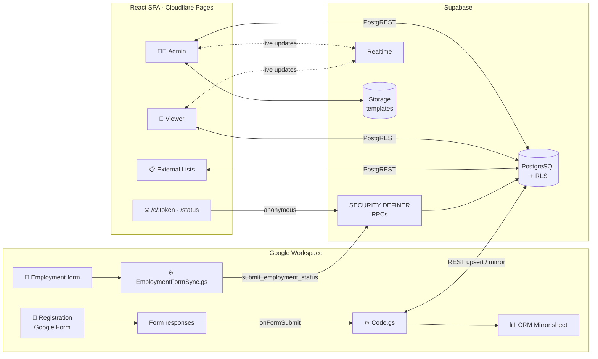
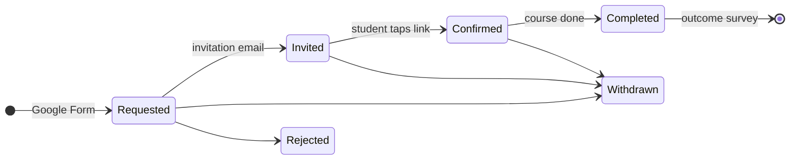

<div align="center">


<h1>CCP CRM</h1>

<p><b>Student enrollment, courses and graduate outcomes for Cork City Partnership, in one place.</b></p>

<p>
Registrations arrive from Google Forms, move across a real-time board,<br/>
and leave as invitations, certificates and outcome surveys.
</p>

<p>
  
  
  
  
  
  
  
  
</p>

<p>
  <a href="#-at-a-glance">At a glance</a> ·
  <a href="#-features">Features</a> ·
  <a href="#-how-it-works">How it works</a> ·
  <a href="#-roles">Roles</a> ·
  <a href="#-quick-start">Quick start</a> ·
  <a href="#-deployment">Deployment</a> ·
  <a href="#-troubleshooting">Troubleshooting</a>
</p>

</div>

---

## 👋 At a glance

A student fills in the registration form. Moments later their card is on the board, and from there every step is a click:

| 1 · Register | 2 · Invite | 3 · Confirm | 4 · Complete | 5 · Follow up |
| :-: | :-: | :-: | :-: | :-: |
| 📝 Google Form | ✉️ Invitation email | 👆 One-tap link | 🎓 Certificate | 📊 Outcome survey |
| Synced by Apps Script, one queue per language | A course date, time and place | The student picks a session | Letters, attendance sheets, labels | Who is working, where, and how |

Everyone on the team sees the same board, live. Nothing is copied between spreadsheets by hand, and student data never leaves the browser to make a document.

> [!TIP]
> Press <kbd>Ctrl</kbd> <kbd>K</kbd> anywhere to find a student or a course, and <kbd>?</kbd> for every keyboard shortcut.

---

## ✨ Features

<table>
<tr>
<td width="50%" valign="top">

### 📋 Enrollment board
- Drag cards from **Requested → Invited → Confirmed → Completed**; **Withdrawn** and **Rejected** stay to one side
- Live for every coordinator (Supabase Realtime)
- One queue per language: a student can wait for Ukrainian and English at once, each with its own place
- Bulk invite, move, copy emails, make documents, delete, with **Undo**
- Priority stars, notes, queue positions and student flags
- Duplicate enrollments blocked in the database, the UI and the sync

</td>
<td width="50%" valign="top">

### ✉️ Invitations & public pages
- Outlook-ready emails and reminders, a template per course
- Short links (`/c/:token`) to confirm in one tap
- **Several dates in one invite**: the student picks a session
- **Capacity**: a live "places left" count, and the form closes when the course is full
- Google Calendar and `.ics` once confirmed; the place links to Google Maps
- A reminder on the dashboard 7 days before a session

</td>
</tr>
<tr>
<td valign="top">

### 👥 Students & data quality
- Instant search by name, email, phone, Eircode or notes
- Duplicate finder (email, phone, fuzzy and swapped names) with a **merge tool**
- "Not a duplicate" is remembered
- Phone numbers stored in international format (`+353…`, `+44…`, `+380…`)
- A shared unsubscribe list that every bulk email respects

</td>
<td valign="top">

### 📄 Documents
- Letters and certificates from `.docx` templates, plus attendance sheets and address labels
- Templates are checked on upload: broken tags rejected, unknown placeholders listed
- Optional single file per template, ready to print
- Per-course presets, custom variables (fixed text, or dates such as `{expire}` = course date + 2 years) and shared Excel columns
- Rendered in a Web Worker: the page stays smooth and a run can be cancelled
- A one-person trial run, a progress bar and a report of what was made
- Styled Excel exports (header filters, frozen header, zebra rows)

</td>
</tr>
<tr>
<td valign="top">

### 🎓 Graduate outcomes
- Survey graduates; track who answered, who works, in what field, full- or part-time
- A public self-report page (`/status`)
- **External lists** (e.g. Action 11 from IRIS): import from Excel, survey, export

</td>
<td valign="top">

### 📊 Analytics
- Pipeline & velocity · Geography & demographics
- Courses & cohorts · Graduate outcomes
- Data explorer with drill-down · Multi-course completers
- Copy emails and export CSV / Excel from every view

</td>
</tr>
<tr>
<td colspan="2" valign="top">

### 🧾 PDF Forms
Fill flat PDF forms (such as the SICAP CO and individual registration forms) from a spreadsheet, one form per row, made for people who are not "computer people":

- **Three plain steps:** your spreadsheet → who needs a form → download. Drop a spreadsheet on the page and the right form opens.
- **Guided set-up:** the blank PDF, an example spreadsheet, check and save. Fields are matched to columns and checkbox labels automatically, and the editor shows the example's real answers in the boxes, so a wrong link is obvious.
- **Messy spreadsheets welcome:** several sheets, titles above the header, repeated or missing column names, totals, hidden rows, Windows-encoded CSV.
- **New revision of the PDF?** Fields follow their labels onto the new layout; anything uncertain is flagged.
- **PDF → Word:** turn a PDF form into a Word template for Documents, laid out exactly like the PDF, with placeholders on its blanks.

<details>
<summary><b>Everything PDF Forms handles</b></summary>

<br/>

**Filling**
- One PDF per row (ZIP) and/or one combined file for printing; a warning when the ZIP gets big
- Large spreadsheets (hundreds of registrations): search and pick the people you need
- "Select one option" questions tick the first answer and warn about the rest; a box can be ticked on every form (e.g. CO type "Local community group")
- Any form can be checked and edited before it is made
- Date blanks (`__/__/20__`, `——/——/——`) get day, month and year from a date column; the registration date is today and "LDC Staff Member" is whoever is signed in
- Eircode is added to the address when the form has no Eircode box; long answers are written between the ruled lines of "Describe …" boxes

**Setting up a form**
- Checkboxes and table cells are read from the PDF itself: click a cell to place a field, click boxes to build a question
- Column names may differ between files (similar names match, and matches can be remembered); answers match loosely ("Youth (Aged <18 Years)" ticks "Youth")
- Values are chosen from lists, never typed as codes; Undo / Redo; a field's settings open beside the page, the rest is in three tabs (Fields · Spreadsheet · More settings)

**Reading spreadsheets**
- The sheet with the form's columns is used, or pick another; header rows below a title or blank lines are found
- Sheets with **no column names** (e.g. an extract of an export) borrow them from the sheet they came from, or you say where the names are (a row, another sheet, or Excel letters)
- Files that Excel opens but the main reader rejects go to a second, more forgiving reader; data validations down to the last row (as in IRIS exports) are cut out before reading; "very hidden" sheets are skipped

**PDF → Word**
- Every line of text, shaded cell, border and logo is placed at the PDF's own coordinates, so the `.docx` prints like the PDF and stays editable
- Blanks are found automatically (empty cells, `____` lines, `__/__/20__` dates, checkboxes); a blank whose label says what it asks gets the matching placeholder (`{firstName}`, `{mobileNumber}`, `{dateOfBirth}`, `{registeredAt}`…)
- Click a blank, then a placeholder (custom variables included for admins), or type fixed text; ticked boxes become real Word check boxes
- Add the file in **Documents → Word templates**: each student gets their own copy

The spreadsheet and the PDF never leave the browser.

</details>

</td>
</tr>
</table>

**And everywhere:** <kbd>Ctrl</kbd> <kbd>K</kbd> command palette · keyboard shortcuts (<kbd>?</kbd>) · light and dark themes · compact density · pages that stay as you left them · smooth page transitions, dialogs that animate in and out and keep keyboard focus, lists that glide instead of jumping (reduced motion respected) · stacked, swipeable notifications · mobile bottom navigation · offline / sync indicator · web push for new confirmations.

---

## 🧭 How it works


```mermaid
flowchart LR
    subgraph Google["Google Workspace"]
        Form["📝 Registration<br/>Google Form"] --> Sheet["Form responses"]
        Sheet -->|onFormSubmit| GAS["⚙️ Code.gs"]
        GAS --> Mirror["📊 CRM Mirror sheet"]
        Survey["📝 Employment form"] --> GAS2["⚙️ EmploymentFormSync.gs"]
    end

    subgraph Supabase["Supabase"]
        DB[("PostgreSQL<br/>+ RLS")]
        RPC["SECURITY DEFINER<br/>RPCs"]
        RT["Realtime"]
        ST[("Storage<br/>templates")]
    end

    subgraph Web["React SPA · Cloudflare Pages"]
        Admin["🧑‍💼 Admin"]
        Viewer["👀 Viewer"]
        Outreach["📋 External Lists"]
        Public["🌐 /c/:token · /status"]
    end

    GAS <-->|REST upsert / mirror| DB
    GAS2 -->|submit_employment_status| RPC
    Admin & Viewer & Outreach <-->|PostgREST| DB
    Admin & Viewer <-.->|live updates| RT
    Admin <--> ST
    Public -->|anonymous| RPC --> DB
```

<details>
<summary><b>Enrollment lifecycle</b></summary>

<br/>


```mermaid
stateDiagram-v2
    direction LR
    [*] --> Requested: Google Form
    Requested --> Invited: invitation email
    Invited --> Confirmed: student taps link
    Confirmed --> Completed: course done
    Completed --> [*]: outcome survey
    Requested --> Withdrawn
    Invited --> Withdrawn
    Confirmed --> Withdrawn
    Requested --> Rejected
```

</details>

---

## 🔐 Roles

Roles live in Supabase `auth.users.app_metadata.role`. New sign-ups join as **viewers**; admins promote them in **Settings → Users & Roles**.

| Role | Sees | Can |
| :-- | :-- | :-- |
| 🧑‍💼 **Admin** | Everything | Manage students, courses, enrollments, templates, analytics, settings and user roles |
| 👀 **Viewer** | Home · Students · Courses · External Lists · PDF Forms | Read rosters, request course completion for admin approval, fill PDF forms |
| 📋 **External Lists** | External Lists · PDF Forms | Import, survey and export outreach contacts; fill PDF forms |
| 🧾 **PDF Forms** | PDF Forms | Set up PDF form templates (forms, new revisions, column links) and fill them |

> [!NOTE]
> Public pages (`/confirm`, `/c/:token`, `/status`) never touch tables directly. They call hardened `SECURITY DEFINER` functions with a pinned `search_path`, and anonymous `EXECUTE` is revoked everywhere else.

---

## 🛠 Tech stack

| Layer | Choice |
| :-- | :-- |
| **UI** | React 19 (`<ViewTransition>` between pages, `<Activity>` keeps visited pages alive), TypeScript 6, Tailwind CSS 4 (+ `tw-animate-css`), Lucide icons, Radix Tooltip, self-hosted Inter & JetBrains Mono |
| **Motion** | One dialog layer for every modal, sheet and drawer (focus trap, exit animations), `sonner` toasts, `@formkit/auto-animate` lists |
| **Routing & data** | React Router 7, TanStack Query 5 (cache, prefetch on hover, realtime patches) |
| **Board** | `@dnd-kit/core` |
| **Email editor** | TipTap 3 (ProseMirror), Outlook-safe HTML output |
| **Charts** | Recharts 3 |
| **Documents** | `docxtemplater` + `pizzip` in a Web Worker |
| **Spreadsheets** | `write-excel-file` for exports; a small built-in `.xlsx` reader for imports |
| **PDF forms** | `pdf-lib` (+ `@pdf-lib/fontkit`, Arimo font), `pdfjs-dist` |
| **Backend** | Supabase: PostgreSQL, Row Level Security, RPCs, Realtime, Storage, an Edge Function for web push |
| **Automation** | Google Apps Script (form sync, CRM Mirror sheet, employment survey sync) |
| **Quality** | Vitest 5 + Testing Library (VM pool, ~20 s), ESLint 10 (zero warnings), `tsc` strict, GitHub Actions CI on every pull request |
| **Build & hosting** | Vite 8 (Rolldown, long-lived vendor chunks), Cloudflare Pages with strict security headers and a CSP |
| **Backups** | Nightly encrypted Supabase backup to Cloudflare R2 (GitHub Actions) |

---

## 🚀 Quick start

**You need:** Node.js 24 LTS (at least 20.19 / 22.12, required by Vite 8) and a Supabase project.

```bash
git clone https://github.com/ihorvasyliev-gh/CRM-From-Google.git
cd CRM-From-Google/frontend
cp ../.env.example .env        # then fill in the two values below
npm install
npm run dev                    # http://localhost:5173
```

```env
VITE_SUPABASE_URL=https://your-project-id.supabase.co
VITE_SUPABASE_ANON_KEY=your-anon-public-key
```

<details>
<summary><b>🗄️ Database</b></summary>

<br/>

1. In the Supabase **SQL Editor**, run [`supabase/schema.sql`](supabase/schema.sql).
2. Apply the numbered migrations in [`supabase/`](supabase/) in order, from `01_…` to the latest.
3. **Storage:** migration 32 creates the `templates` bucket for `.docx` templates (migration 73 makes it private), and migration 75 creates the private `pdf-forms` bucket. If the SQL Editor may not change storage, they print what to set up by hand.
4. *(Optional, web push)* deploy [`supabase/functions/send-push-notification`](supabase/functions/send-push-notification).

</details>

<details>
<summary><b>⚙️ Google Apps Script</b></summary>

<br/>

1. Open the Google Sheet linked to the registration form → **Extensions → Apps Script**.
2. Paste [`google-apps-script/Code.gs`](google-apps-script/Code.gs).
3. In **Project Settings → Script Properties**, add:
   - `SUPABASE_URL`: your project URL
   - `SUPABASE_KEY`: the `service_role` key (the sync bypasses RLS, so keep it secret)
4. Reload the sheet and choose **🔄 CRM Sync → 🛠 Settings: Triggers** to install the form and hourly mirror triggers.
5. For the employment survey, repeat with [`EmploymentFormSync.gs`](google-apps-script/EmploymentFormSync.gs) in the survey form's own project.

Large backfills run in batches and resume on their own, so they stay under Apps Script's 6-minute limit.

</details>

<details>
<summary><b>🧬 Database types (optional)</b></summary>

<br/>

The Supabase CLI can write TypeScript types for every table, view and RPC of the live database, so queries are checked by `tsc`. With a [personal access token](https://supabase.com/dashboard/account/tokens) and the project ref (the `xxxx` in `xxxx.supabase.co`):

```bash
cd frontend
npx supabase login
npx supabase gen types typescript --project-id <project-ref> --schema public > src/lib/database.types.ts
```

Then pass the `Database` type to `createClient<Database>(…)` in [`src/lib/supabase.ts`](frontend/src/lib/supabase.ts). Run it again after each migration.

</details>

<details>
<summary><b>🧪 Checks</b></summary>

<br/>

```bash
npm run test:run   # unit & component tests (Vitest)
npm run lint       # ESLint, zero warnings allowed
npm run build      # tsc + production build
```

The same three run on GitHub for every pull request and push to `main` ([`.github/workflows/ci.yml`](.github/workflows/ci.yml)).

</details>

---

## 🌐 Deployment

**Cloudflare Pages**

| Setting | Value |
| :-- | :-- |
| Root directory | `frontend` |
| Build command | `npm run build` |
| Output directory | `dist` |
| Environment variables | `VITE_SUPABASE_URL`, `VITE_SUPABASE_ANON_KEY` |
| Node.js | 24 LTS, pinned by [`frontend/.node-version`](frontend/.node-version) |

Security headers, the CSP and cache rules ship from [`frontend/public/_headers`](frontend/public/_headers). SPA routing works out of the box.

**Backups:** [`.github/workflows/supabase-backup.yml`](.github/workflows/supabase-backup.yml) saves the database and Storage to Cloudflare R2 every night, encrypted. Setup, restore and manual options are in [`backups/README.md`](backups/README.md).

---

## 🩺 Troubleshooting

| Symptom | Likely cause | Fix |
| :-- | :-- | :-- |
| `401` / RLS errors | Session expired, or the role lacks access | Sign in again; check the role in **Settings → Users & Roles** |
| Invitation link says **expired** | Past the `response_days` window | Resend the invitation from the board |
| Confirmation page says **course full** | Capacity reached | Raise `max_capacity` on the course, or offer another date |
| Apps Script timeout | A very large backfill | Use **Export ALL answers**; it batches and resumes on its own |
| Template placeholders left empty | A misspelled tag | Upload and generation list unknown placeholders; use a name from **Documents → Available variables** (e.g. `{firstName}`, `{courseTitle}`, `{courseDate}`) or add a custom variable |
| Student missing from a bulk email | They unsubscribed | See **Settings → Unsubscribed emails** |
| Browser console on the live site shows nothing | Production keeps the console silent ([`quietConsole.ts`](frontend/src/lib/quietConsole.ts)) | Run `localStorage.setItem('crm:debug', '1')` in the console and reload to see warnings and errors; `localStorage.removeItem('crm:debug')` turns it off |
| Stuck on **Loading Portal…**, or *"A new version is available"* | A deploy replaced the code while the page was open | The app re-downloads and reloads on its own (`public/boot-recovery.js`); open tabs show a **Reload** bar. If it still hangs, press **Try again** on the loading screen |

---

## 📁 Project structure

```text
CRM-From-Google/
├── frontend/                      React + Vite SPA
│   ├── public/                    _headers (CSP, caching), service worker, boot scripts, logos
│   └── src/
│       ├── components/
│       │   ├── Analytics/         six analytics views + shared utils
│       │   ├── Dashboard/         KPIs, activity feed, reminders
│       │   ├── DocumentGenerator/ templates, presets, generation report
│       │   ├── EmailEditor/       TipTap editor for email templates
│       │   ├── EnrollmentBoard/   columns, cards, filters, bulk bar, invite dialogs
│       │   ├── PdfForms/          form editor, fill view, PDF → Word
│       │   ├── Viewer/            read-only viewer portal
│       │   └── ui/                Modal, Button, Badge, Tabs, Tooltip, StatTile…
│       ├── contexts/              auth, network status
│       ├── hooks/                 data, realtime, modal and presence hooks
│       ├── lib/                   Supabase queries, email templates, documents
│       │   ├── pdfForms/          spreadsheet reading, field mapping, PDF filling
│       │   └── pdfToDocx/         PDF → Word conversion
│       ├── App.tsx                admin shell, navigation, shortcuts
│       └── main.tsx               routes, public pages, query client
├── supabase/
│   ├── schema.sql                 base schema
│   ├── NN_*.sql                   numbered migrations, applied in order
│   └── functions/                 send-push-notification Edge Function
├── google-apps-script/
│   ├── Code.gs                    registration form ⇄ Supabase ⇄ CRM Mirror
│   └── EmploymentFormSync.gs      employment survey → Supabase
├── backups/                       backup scripts and guide
└── .github/workflows/             CI (lint, tests, build) and the nightly backup to Cloudflare R2
```

---

<div align="center">

**Private repository. All rights reserved.**<br/>
Built for <b>Cork City Partnership CLG</b> education & community training programmes, supported by <b>SICAP</b>.

</div>
